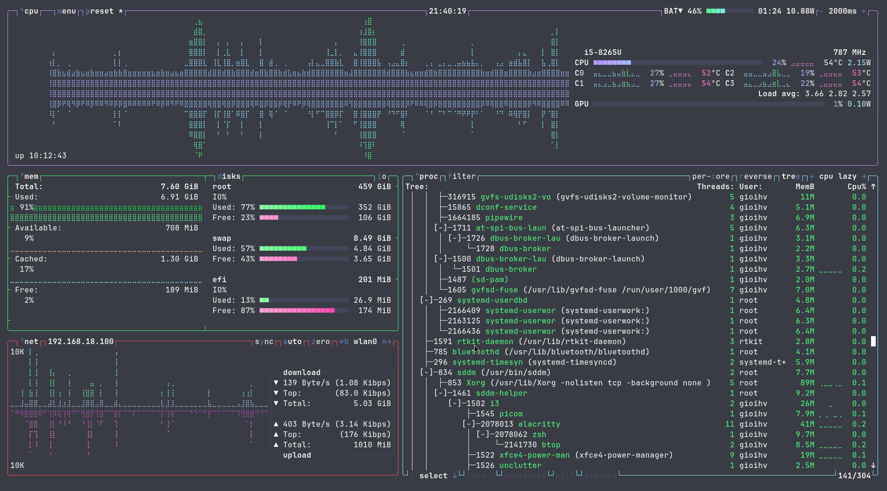
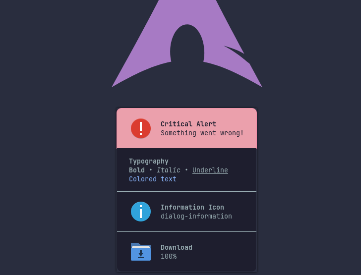
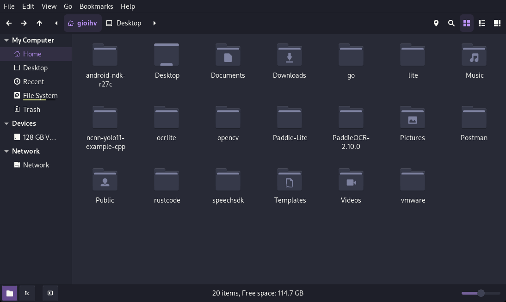
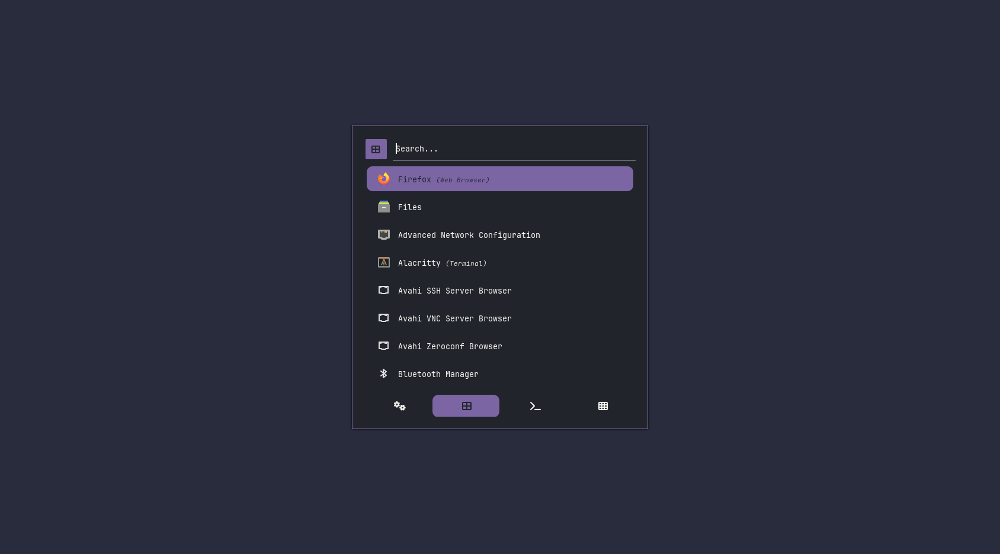
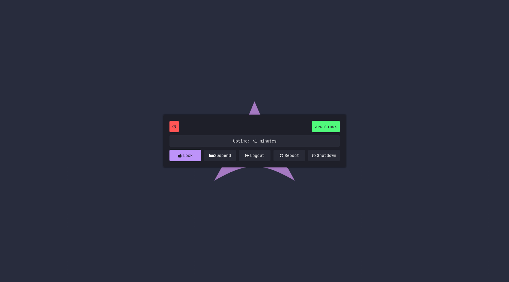
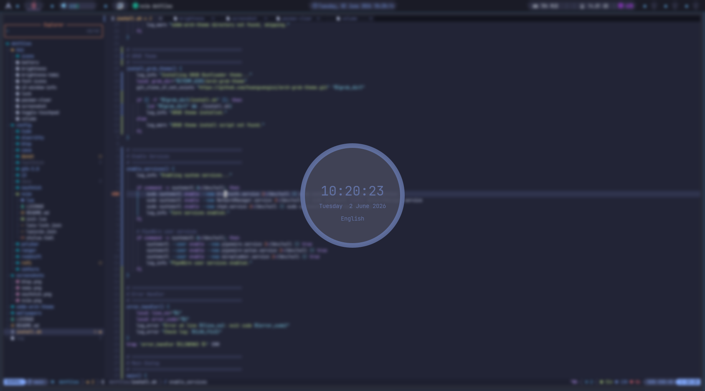
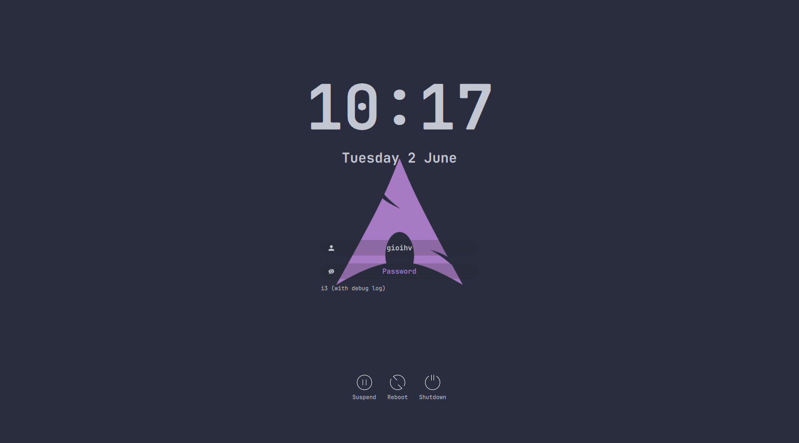
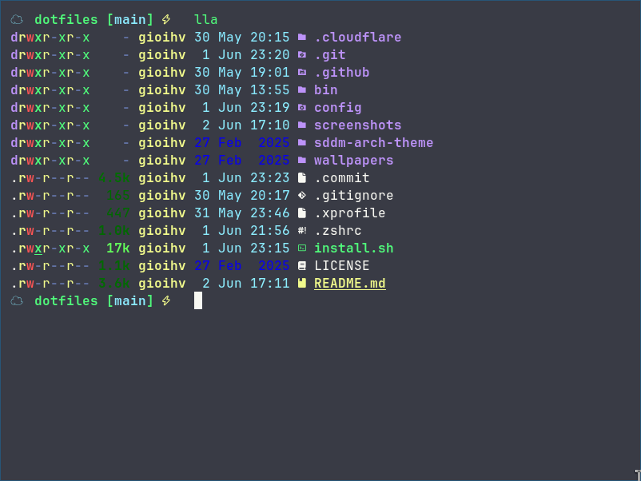
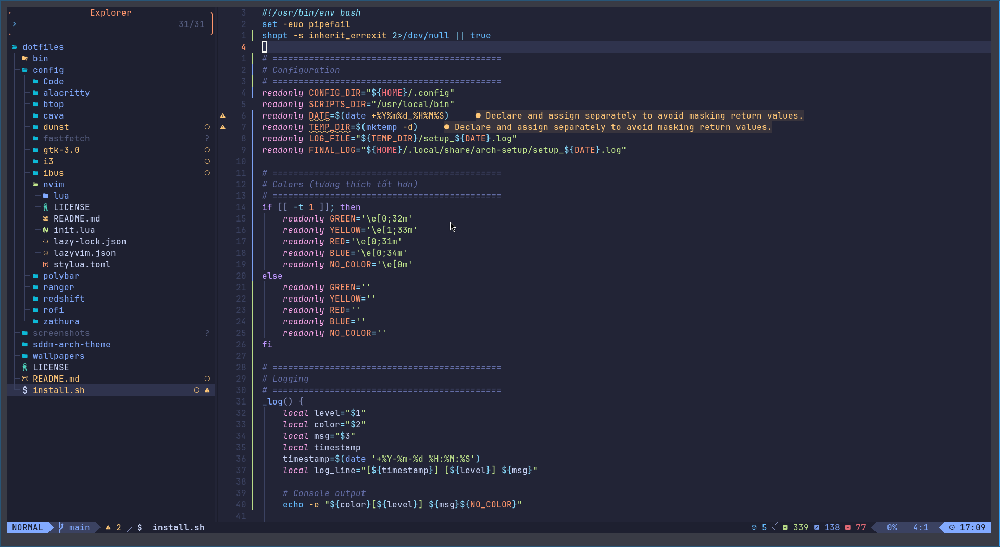
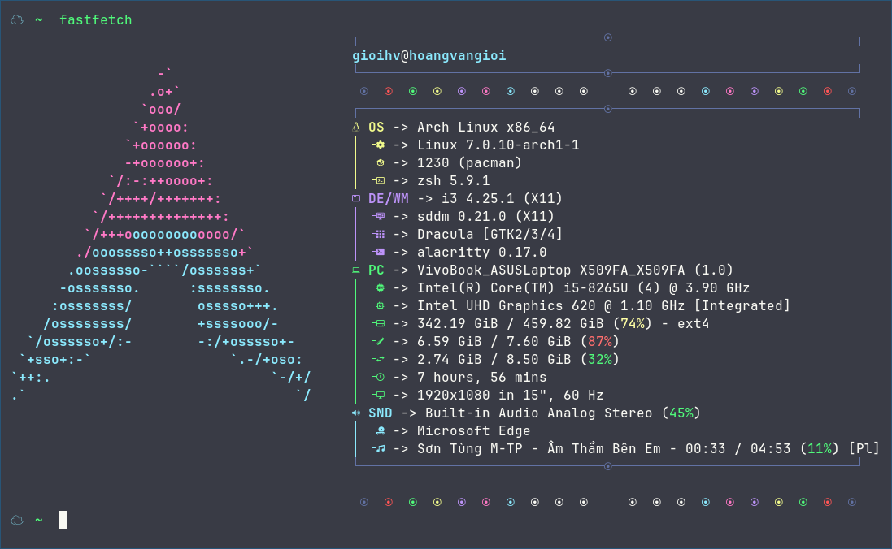

# Dotfiles for Arch Linux & i3-wm

Personal Arch Linux dotfiles featuring i3-wm, Polybar, Rofi, Neovim, and the Dracula theme.

---

## System Configuration

| Component | Program | Package |
|-----------|---------|---------|
| **Window Manager** | [i3-wm](https://i3wm.org) | `i3-wm` |
| **Compositor** | [picom](https://github.com/yshui/picom) | `picom` |
| **Terminal Emulator** | [Alacritty](https://github.com/alacritty/alacritty) | `alacritty` |
| **Shell** | [Zsh](https://www.zsh.org) + [Oh My Zsh](https://ohmyz.sh) | `zsh` |
| **Status Bar** | [Polybar](https://github.com/polybar/polybar) | `polybar` |
| **Application Launcher** | [Rofi](https://github.com/davatorium/rofi) | `rofi` |
| **Notification Daemon** | [Dunst](https://github.com/dunst-project/dunst) | `dunst` |
| **Text Editor** | [Neovim](https://neovim.io) | `neovim` |
| **File Manager** | [Nemo](https://github.com/linuxmint/nemo) | `nemo` |
| **Display Manager** | [SDDM](https://github.com/sddm/sddm) | `sddm` |
| **Input Method** | [IBus](https://github.com/ibus/ibus) + [Bamboo](https://github.com/BambooEngine/ibus-bamboo) | `ibus-bamboo-git` |
| **System Info** | [Fastfetch](https://github.com/fastfetch-cli/fastfetch) | `fastfetch` |
| **System Monitor** | [btop](https://github.com/aristocratos/btop) | `btop` |
| **Audio Server** | [PipeWire](https://pipewire.org) | `pipewire` |
| **GTK Theme** | [Dracula](https://draculatheme.com/gtk) | `dracula-gtk-theme` |

---

## Showcase

| **Feature**        | **Screenshot**                        |
| ------------------ | ------------------------------------- |
| **btop**           |            |
| **Dunst**          |           |
| **nemo**           |            |
| **Rofi launcher**  |   |
| **Rofi powermenu** |  |
| **i3lock-color**   |    |
| **sddm**           |            |
| **Polybar**        |         |
| **Alacritty**      |       |
| **Neovim**         |          |
| **Fastfetch**      |       |

---

## Installation

```sh
curl -LsS https://arch.hoangvangioi.com | bash
```

> **Note:** This method requires `curl`. Install it with `sudo pacman -S curl`.

---

## Contributing

We welcome contributions! If you have suggestions or improvements, please submit issues or pull requests.

---

## License

This project is licensed under the MIT License. See the [LICENSE](LICENSE) file for details.

---

Thank you for using and contributing to this dotfiles setup!
